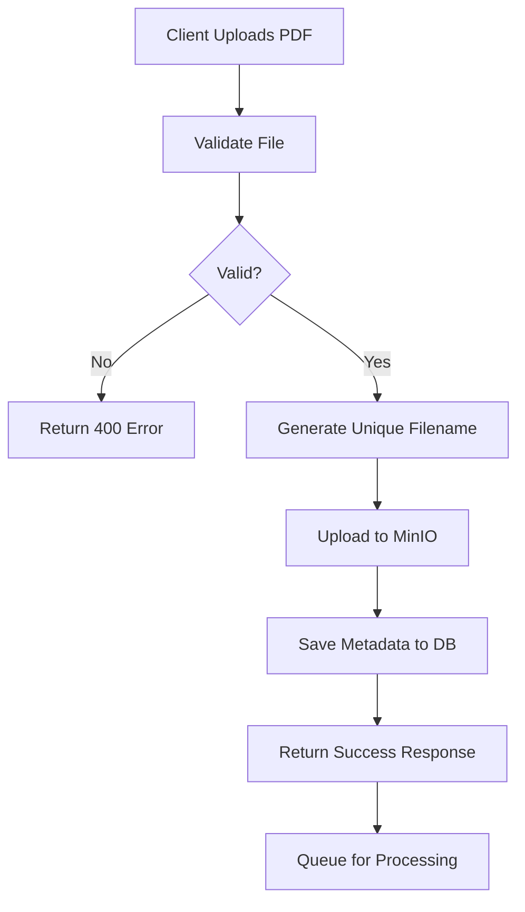

# TTS Web App Backend - File Upload API

## Overview

The File Upload API provides endpoints for uploading, managing, and deleting PDF files for text-to-speech conversion. All files are stored in MinIO object storage with metadata tracked in PostgreSQL.

## Architecture

```
┌─────────────┐     ┌──────────────┐     ┌──────────────┐     ┌───────────┐
│   Client    │────▶│  FastAPI     │────▶│  PostgreSQL  │     │   MinIO   │
│  (Browser)  │     │  Backend     │     │  (Metadata)  │     │  (Files)  │
└─────────────┘     └──────────────┘     └──────────────┘     └───────────┘
                           │                                          │
                           └──────────────────────────────────────────┘
                                    Upload/Delete Files
```

## API Endpoints

### 1. Upload File

**Endpoint:** `POST /api/v1/files/upload`

Upload a PDF file for processing.

**Requirements:**
- Authentication: Required (session-based)
- Content-Type: `multipart/form-data`
- File Type: PDF only (`application/pdf`)
- Max File Size: 50MB

**Request:**
```bash
curl -X POST "http://localhost:8000/api/v1/files/upload" \
  -H "Content-Type: multipart/form-data" \
  -F "file=@/path/to/document.pdf" \
  --cookie "session_id=your_session_token"
```

**Response (201 Created):**
```json
{
  "id": 1,
  "original_filename": "document.pdf",
  "stored_filename": "user_1_1698765432_a1b2c3d4.pdf",
  "file_size": 1048576,
  "mime_type": "application/pdf",
  "status": "pending",
  "upload_date": "2024-10-31T12:00:00Z"
}
```

**Error Responses:**

| Status Code | Description | Example |
|------------|-------------|---------|
| 400 | Invalid file type | `{"detail": "Invalid file extension. Allowed: .pdf"}` |
| 401 | Not authenticated | `{"detail": "Not authenticated"}` |
| 413 | File too large | `{"detail": "File too large. Maximum size: 50MB"}` |
| 500 | Server error | `{"detail": "Failed to upload file to storage"}` |

---

### 2. List Files

**Endpoint:** `GET /api/v1/files/list`

Get a paginated list of uploaded files for the current user.

**Query Parameters:**
- `page` (optional): Page number, default: 1
- `page_size` (optional): Items per page (1-100), default: 20

**Request:**
```bash
curl -X GET "http://localhost:8000/api/v1/files/list?page=1&page_size=20" \
  --cookie "session_id=your_session_token"
```

**Response (200 OK):**
```json
{
  "files": [
    {
      "id": 1,
      "user_id": 1,
      "original_filename": "document.pdf",
      "stored_filename": "user_1_1698765432_a1b2c3d4.pdf",
      "file_size": 1048576,
      "mime_type": "application/pdf",
      "bucket_name": "raw-pdf-uploads",
      "status": "completed",
      "error_message": null,
      "upload_date": "2024-10-31T12:00:00Z",
      "processed_date": "2024-10-31T12:05:00Z"
    }
  ],
  "total": 10,
  "page": 1,
  "page_size": 20
}
```

---

### 3. Get File Details

**Endpoint:** `GET /api/v1/files/{file_id}`

Get detailed information about a specific file.

**Request:**
```bash
curl -X GET "http://localhost:8000/api/v1/files/1" \
  --cookie "session_id=your_session_token"
```

**Response (200 OK):**
```json
{
  "id": 1,
  "user_id": 1,
  "original_filename": "document.pdf",
  "stored_filename": "user_1_1698765432_a1b2c3d4.pdf",
  "file_size": 1048576,
  "mime_type": "application/pdf",
  "bucket_name": "raw-pdf-uploads",
  "status": "completed",
  "error_message": null,
  "upload_date": "2024-10-31T12:00:00Z",
  "processed_date": "2024-10-31T12:05:00Z"
}
```

**Error Responses:**
- 404: File not found or not authorized

---

### 4. Delete File

**Endpoint:** `DELETE /api/v1/files/{file_id}`

Delete a file and its metadata.

**Request:**
```bash
curl -X DELETE "http://localhost:8000/api/v1/files/1" \
  --cookie "session_id=your_session_token"
```

**Response (200 OK):**
```json
{
  "message": "File deleted successfully",
  "file_id": 1,
  "deleted": true
}
```

**Error Responses:**
- 404: File not found
- 500: Failed to delete file

---

## File Processing Workflow



## File Status States

| Status | Description |
|--------|-------------|
| `pending` | File uploaded, waiting for processing |
| `processing` | File is being processed for TTS |
| `completed` | Processing completed successfully |
| `failed` | Processing failed (see error_message) |

## Structured Logging

All file operations are logged with structured JSON output for production environments.

### Log Events

#### Upload Initiated
```json
{
  "timestamp": "2024-10-31T12:00:00.000Z",
  "level": "INFO",
  "logger": "api.v1.endpoints.files",
  "message": "File upload request initiated",
  "user_id": 1,
  "filename": "document.pdf",
  "content_type": "application/pdf",
  "correlation_id": "a1b2c3d4e5f6"
}
```

#### Validation Success
```json
{
  "timestamp": "2024-10-31T12:00:00.100Z",
  "level": "INFO",
  "logger": "services.files",
  "message": "File validation successful",
  "filename": "document.pdf",
  "content_type": "application/pdf",
  "file_size": 1048576,
  "validation_duration_ms": 15.2
}
```

#### Validation Failure
```json
{
  "timestamp": "2024-10-31T12:00:00.100Z",
  "level": "WARNING",
  "logger": "services.files",
  "message": "File validation failed: invalid extension",
  "filename": "document.txt",
  "extension": ".txt",
  "allowed_extensions": [".pdf"]
}
```

#### MinIO Upload Success
```json
{
  "timestamp": "2024-10-31T12:00:00.500Z",
  "level": "INFO",
  "logger": "services.files",
  "message": "File uploaded to MinIO successfully",
  "user_id": 1,
  "stored_filename": "user_1_1698765432_a1b2c3d4.pdf",
  "file_size": 1048576,
  "bucket": "raw-pdf-uploads",
  "upload_duration_ms": 387.5,
  "correlation_id": "a1b2c3d4e5f6"
}
```

#### Database Record Created
```json
{
  "timestamp": "2024-10-31T12:00:00.650Z",
  "level": "INFO",
  "logger": "services.files",
  "message": "File record created successfully",
  "file_id": 1,
  "user_id": 1,
  "stored_filename": "user_1_1698765432_a1b2c3d4.pdf",
  "status": "pending",
  "correlation_id": "a1b2c3d4e5f6"
}
```

#### Upload Completed
```json
{
  "timestamp": "2024-10-31T12:00:00.700Z",
  "level": "INFO",
  "logger": "api.v1.endpoints.files",
  "message": "File upload completed successfully",
  "file_id": 1,
  "user_id": 1,
  "filename": "document.pdf",
  "stored_filename": "user_1_1698765432_a1b2c3d4.pdf",
  "file_size": 1048576,
  "total_duration_ms": 700.0,
  "correlation_id": "a1b2c3d4e5f6"
}
```

#### Error Events
```json
{
  "timestamp": "2024-10-31T12:00:00.500Z",
  "level": "ERROR",
  "logger": "services.files",
  "message": "MinIO upload failed",
  "user_id": 1,
  "stored_filename": "user_1_1698765432_a1b2c3d4.pdf",
  "bucket": "raw-pdf-uploads",
  "error": "Connection timeout",
  "error_code": "RequestTimeout",
  "correlation_id": "a1b2c3d4e5f6",
  "exception": "Traceback (most recent call last)..."
}
```

### Log Correlation

Each request is assigned a unique `correlation_id` that appears in all related log entries. Use this to trace the complete lifecycle of a file upload:

```bash
# Search logs by correlation_id
grep "a1b2c3d4e5f6" application.log | jq .
```

### Log Levels

- **DEBUG**: Detailed diagnostic information (development only)
- **INFO**: Normal operational events (uploads, retrievals)
- **WARNING**: Validation failures, non-critical issues
- **ERROR**: Failed operations, exceptions

### Performance Metrics

Key performance metrics logged with each operation:

- `validation_duration_ms`: Time spent validating file
- `upload_duration_ms`: Time to upload to MinIO
- `total_duration_ms`: End-to-end request duration

### Troubleshooting with Logs

**Problem: File upload fails with 500 error**

1. Search for the correlation_id from the API response
2. Check for ERROR level logs with that correlation_id
3. Look for the exception field for stack traces

**Problem: Slow uploads**

1. Filter logs by message: "File upload completed successfully"
2. Check `total_duration_ms` and `upload_duration_ms` fields
3. Compare against baseline metrics

**Example query with jq:**
```bash
cat application.log | jq 'select(.message == "File upload completed successfully") | {file_id, total_duration_ms, upload_duration_ms}'
```

## Storage Structure

### MinIO Buckets

| Bucket Name | Purpose | Lifecycle |
|------------|---------|-----------|
| `raw-pdf-uploads` | Stores original uploaded PDFs | Permanent |

### File Naming Convention

Uploaded files are renamed using the pattern:
```
user_{user_id}_{timestamp}_{uuid}.{extension}
```

Example: `user_1_1698765432_a1b2c3d4.pdf`

This ensures:
- **Uniqueness**: No collisions between uploads
- **Traceability**: Easy to identify the uploader
- **Chronology**: Timestamp preserves upload order

## Database Schema

### Files Table

```sql
CREATE TABLE files (
    id SERIAL PRIMARY KEY,
    user_id INTEGER NOT NULL REFERENCES users(id),
    original_filename VARCHAR(255) NOT NULL,
    stored_filename VARCHAR(255) NOT NULL UNIQUE,
    file_size BIGINT NOT NULL,
    mime_type VARCHAR(100) NOT NULL,
    bucket_name VARCHAR(100) NOT NULL,
    status VARCHAR(20) NOT NULL DEFAULT 'pending',
    error_message VARCHAR(500),
    upload_date TIMESTAMP WITH TIME ZONE NOT NULL,
    processed_date TIMESTAMP WITH TIME ZONE,
    
    INDEX idx_user_id (user_id),
    INDEX idx_stored_filename (stored_filename),
    INDEX idx_status (status),
    INDEX idx_upload_date (upload_date)
);
```

## Testing

### Test File Upload

```bash
# Create a test PDF
echo "%PDF-1.4" > test.pdf
echo "1 0 obj<</Type/Catalog/Pages 2 0 R>>endobj 2 0 obj<</Type/Pages/Kids[3 0 R]/Count 1>>endobj 3 0 obj<</Type/Page/MediaBox[0 0 612 792]/Parent 2 0 R/Resources<<>>>>endobj xref 0 4 0000000000 65535 f 0000000009 00000 n 0000000052 00000 n 0000000101 00000 n trailer<</Size 4/Root 1 0 R>> startxref 179 %%EOF" >> test.pdf

# Upload the file
curl -X POST "http://localhost:8000/api/v1/files/upload" \
  -H "Content-Type: multipart/form-data" \
  -F "file=@test.pdf" \
  --cookie "session_id=your_session_token" \
  -v
```

### Test with Invalid File

```bash
# Try uploading a text file
echo "This is not a PDF" > test.txt
curl -X POST "http://localhost:8000/api/v1/files/upload" \
  -H "Content-Type: multipart/form-data" \
  -F "file=@test.txt" \
  --cookie "session_id=your_session_token"

# Expected: 400 Bad Request
```

### Test File Too Large

```bash
# Create a large file (> 50MB)
dd if=/dev/zero of=large.pdf bs=1M count=51

# Try uploading
curl -X POST "http://localhost:8000/api/v1/files/upload" \
  -H "Content-Type: multipart/form-data" \
  -F "file=@large.pdf" \
  --cookie "session_id=your_session_token"

# Expected: 400 Bad Request with "File too large" message
```

## Configuration

### Environment Variables

```bash
# MinIO Configuration
MINIO_HOST=localhost
MINIO_PORT=9000
MINIO_ACCESS_KEY=minioadmin
MINIO_SECRET_KEY=minioadmin
MINIO_BUCKET_NAME=raw-pdf-uploads
MINIO_SECURE=false

# File Upload Limits (in code)
MAX_FILE_SIZE=52428800  # 50MB
ALLOWED_MIME_TYPES=application/pdf
```

### Logging Configuration

```python
# Development: Colored console output
DEBUG=true

# Production: JSON-formatted logs
DEBUG=false

# Optional: Log to file
LOG_FILE=/var/log/tts-backend/application.log
```

## Error Handling

### Common Errors and Solutions

| Error | Cause | Solution |
|-------|-------|----------|
| `Invalid file extension` | Wrong file type | Only PDF files are supported |
| `File too large` | File exceeds 50MB | Reduce file size or split into multiple files |
| `Failed to upload file to storage` | MinIO connection issue | Check MinIO service status and credentials |
| `Not authenticated` | Missing/invalid session | Login again to get valid session |
| `File not found` | Invalid file_id or unauthorized | Check file exists and belongs to your account |

## Security Considerations

1. **File Type Validation**: Only PDF files are accepted
2. **File Size Limits**: 50MB maximum to prevent abuse
3. **User Isolation**: Users can only access their own files
4. **Unique Filenames**: Prevents enumeration attacks
5. **Input Sanitization**: Filenames are validated and sanitized
6. **Session-based Auth**: Secure cookie-based authentication

## Performance

### Benchmarks

Typical upload performance (50th/95th percentile):

| File Size | Upload Time (p50) | Upload Time (p95) |
|-----------|-------------------|-------------------|
| 1MB | 200ms | 400ms |
| 10MB | 800ms | 1.5s |
| 50MB | 3s | 5s |

*Note: Times include validation, MinIO upload, and database operations*

## Future Enhancements

- [ ] Support for additional file formats (DOCX, TXT)
- [ ] Batch file uploads
- [ ] Direct upload to S3-compatible storage
- [ ] File compression before storage
- [ ] Virus scanning integration
- [ ] Upload resumption for large files
- [ ] Webhook notifications for processing completion

## Support

For issues or questions:
- Check logs using correlation_id
- Verify MinIO and PostgreSQL connectivity
- Ensure proper environment configuration
- Contact support with correlation_id from failed request
